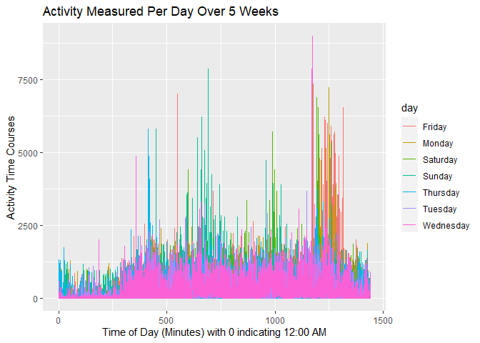
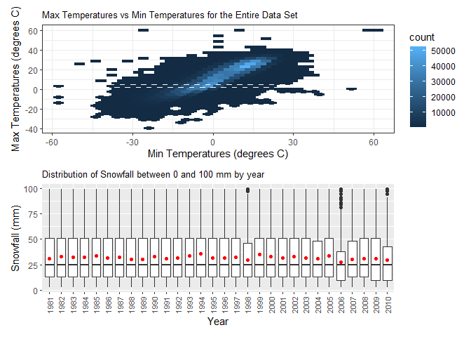

p8105\_hw3\_as6183
================

# Problem 1:

``` r
library(p8105.datasets)
library(tidyverse)
```

    ## -- Attaching packages -------------------------------------- tidyverse 1.3.0 --

    ## v ggplot2 3.3.2     v purrr   0.3.4
    ## v tibble  3.0.3     v dplyr   1.0.1
    ## v tidyr   1.1.2     v stringr 1.4.0
    ## v readr   1.3.1     v forcats 0.5.0

    ## -- Conflicts ----------------------------------------- tidyverse_conflicts() --
    ## x dplyr::filter() masks stats::filter()
    ## x dplyr::lag()    masks stats::lag()

``` r
library(plyr)
```

    ## ------------------------------------------------------------------------------

    ## You have loaded plyr after dplyr - this is likely to cause problems.
    ## If you need functions from both plyr and dplyr, please load plyr first, then dplyr:
    ## library(plyr); library(dplyr)

    ## ------------------------------------------------------------------------------

    ## 
    ## Attaching package: 'plyr'

    ## The following objects are masked from 'package:dplyr':
    ## 
    ##     arrange, count, desc, failwith, id, mutate, rename, summarise,
    ##     summarize

    ## The following object is masked from 'package:purrr':
    ## 
    ##     compact

``` r
library(dplyr)
data("instacart")
```

The Instacart data set gives information on over 3 million online
grocery orders from more than 200,000 Instacart users in 2017. The size
of this dataset is 1384617 rows and 15 columns. Some key variables would
be the reordered variable to assess what customers are re-buying
frequently, the product name to analyze what products are customers
buying most and least frequently, the user id to keep track of which
customer is buying what, and the department to analyze which category of
items are getting purchased most/least frequently.

``` r
number_aisles = count(instacart,vars=c('aisle','aisle_id'))%>%
  nrow()

most_ordered = instacart%>%
  count(vars=c('aisle','aisle_id'))%>%
  select('freq')%>%
  max()
```

There are 134 aisles and

``` r
library(ggplot2)
aisles_10000 = instacart%>%
  count(vars=c('aisle','aisle_id'))%>%
  filter(freq>10000)

instacart_10000 = filter(instacart,aisle%in%pull(aisles_10000,aisle))

ggplot(instacart_10000,aes(x=aisle))+geom_bar()
```

<!-- -->

``` r
#library(data.table)
data = instacart%>%
  filter(aisle=="baking ingredients"|aisle=="dog food care"|aisle=="packaged vegetables fruits")

most_popular = data%>%
  count(vars=c('aisle','product_name'))

most_popular = most_popular%>%
  group_by(aisle)%>%
  dplyr::arrange(desc(freq),by_group=T)%>%
  top_n(n=3,wt=freq)

#data.table(aisle=pull(most_popular,aisle),product_name=pull(most_popular,product_name),freq=pull(most_popular,freq))
```

``` r
pink_lady_coffee_ice_cream = instacart%>%
  filter(product_name=="Pink Lady Apples"|product_name=="Coffee Ice Cream")%>%
  group_by(order_dow,product_name)
  
table = dplyr::summarise(pink_lady_coffee_ice_cream,mean=mean(order_hour_of_day))%>%
  ungroup()%>%
  pivot_wider(names_from=order_dow,values_from=mean)
```

    ## `summarise()` regrouping output by 'order_dow' (override with `.groups` argument)

``` r
colnames(table) = c("Product Name", "Monday", "Tuesday","Wednesday","Thursday","Friday","Saturday","Sunday")
table
```

    ## # A tibble: 2 x 8
    ##   `Product Name`   Monday Tuesday Wednesday Thursday Friday Saturday Sunday
    ##   <chr>             <dbl>   <dbl>     <dbl>    <dbl>  <dbl>    <dbl>  <dbl>
    ## 1 Coffee Ice Cream   13.8    14.3      15.4     15.3   15.2     12.3   13.8
    ## 2 Pink Lady Apples   13.4    11.4      11.7     14.2   11.6     12.8   11.9

# Problem 2:

``` r
setwd("/Users/13038/Downloads")
accel = read.csv("accel_data.csv")
accel = accel%>%
  mutate(week = factor(week))%>%
  mutate(weekday_weekend = factor(recode(day,Monday="Weekday",Tuesday="Weekday",Wednesday="Weekday",Thursday="Weekday",Friday="Weekday",Saturday="Weekend",Sunday="Weekend")))%>%
  pivot_longer(activity.1:activity.1440,names_to="Activity_Minute",values_to="Activity_Counts")
```

There are 50400 observations in this data set corresponding to the
number of days in which observations were taken and there are 6
variables which corresponds to the week,day id , day, Activity minute
(one row per minute of every day), Activity Counts which gives the value
of the activity at that particular minute given in the column next to
it, and the weekday vs weekend variable. The value for each activity
time variable gives the activity counted at that particular minute of
the day. Furthermore, in my tidying procedure I have converted the week
variable into a factor since the week is a categorical variable. I also
pivoted the activity variables to the longer format as I thought it
would be easier to manipulate in the next step when I have to aggregate
all of the activity’s together by day.

``` r
total_activity_per_day=aggregate(pull(accel,Activity_Counts),by = list(pull(accel,week),pull(accel,day)),FUN=sum)
accel = accel %>%
  pivot_wider(names_from="Activity_Minute",values_from="Activity_Counts")%>%
  mutate(total_activity_per_day = pull(total_activity_per_day,x))
summarise(.data=accel,Week=week,Day=day,Total_Activity_Per_Day=total_activity_per_day)
```

    ##    Week       Day Total_Activity_Per_Day
    ## 1     1    Friday              480542.62
    ## 2     1    Monday              568839.00
    ## 3     1  Saturday              467420.00
    ## 4     1    Sunday              154049.00
    ## 5     1  Thursday              620860.00
    ## 6     1   Tuesday               78828.07
    ## 7     1 Wednesday              295431.00
    ## 8     2    Friday              685910.00
    ## 9     2    Monday              409450.00
    ## 10    2  Saturday              389080.00
    ## 11    2    Sunday              376254.00
    ## 12    2  Thursday              607175.00
    ## 13    2   Tuesday              382928.00
    ## 14    2 Wednesday                1440.00
    ## 15    3    Friday                1440.00
    ## 16    3    Monday              631105.00
    ## 17    3  Saturday              422018.00
    ## 18    3    Sunday              467052.00
    ## 19    3  Thursday              260617.00
    ## 20    3   Tuesday              138421.00
    ## 21    3 Wednesday              355923.64
    ## 22    4    Friday              474048.00
    ## 23    4    Monday              371230.00
    ## 24    4  Saturday              340291.00
    ## 25    4    Sunday              549658.00
    ## 26    4  Thursday              307094.24
    ## 27    4   Tuesday              423245.00
    ## 28    4 Wednesday              381507.00
    ## 29    5    Friday              319568.00
    ## 30    5    Monday              367824.00
    ## 31    5  Saturday              340115.01
    ## 32    5    Sunday              440962.00
    ## 33    5  Thursday              468869.00
    ## 34    5   Tuesday              434460.00
    ## 35    5 Wednesday              445366.00

``` r
ggplot(data=accel,aes(x=day_id,y=total_activity_per_day,color=day))+geom_point()+xlab("Day ID")+ylab("Total Activity Per Day")+ggtitle("Total Activity Measured Per Day Over 5 Weeks")
```

<!-- -->

# Problem 3:

``` r
library(p8105.datasets)
data("ny_noaa")
```

The ny\_noaa data set contains 2595176 rows and 7 columns. The data set
contains information from all New York state weather stations such as
precipitation in tenths of a mm (prcp), snowfall in mm (snow), snow
depth in mm (snwd), maximum temperature (tmax), minimum temperature
(tmin), as well as the date (date) and station (id) where the
information was collected. Missing data is definitely an issue in this
data set as there are 0, 0, 1.4583810^{5}, 3.8122110^{5}, 5.9178610^{5},
1.13435810^{6}, 1.1344210^{6} rows by column in the data set that
contain missing values. Some of these columns have almost 50% of the
data missing which is a very large amount.

``` r
ny_noaa=separate(ny_noaa,col="date",into=c("year","month","day"),sep="-")
ny_noaa=ny_noaa%>%
  dplyr::arrange(year,month)%>%
  mutate(prcp=prcp/100,snow=snow/10,snwd=snwd/10,tmax=as.integer(tmax)/10,tmin=as.integer(tmin)/10)
mode_snowfall = data.frame(table(pull(ny_noaa,snow)))
```

For snowfall, the most commonly observed values are 0 cm. This is
probably because there is not that much snow between the months of April
through October or November in most areas of the United States,
including New York. Therefore, for most of the year you will see 0 cm of
snowfall recorded which is why it is the most commonly observed value
for snowfall.

``` r
data = aggregate(pull(ny_noaa,tmax),by = list(pull(ny_noaa,month),pull(ny_noaa,year),pull(ny_noaa,id)),FUN=mean,na.rm=T)
data = filter(data,Group.1=="01"|Group.1=="07")
data = na.omit(data)
ggplot(data, aes(x = Group.2, y = x)) +
  geom_boxplot()+
  facet_grid(. ~ Group.1)
```

<!-- -->

``` r
# data = cbind(pull(ny_noaa,t_max),pull(ny_noaa,t_min))
# ggplot(ny_noaa, aes(x = , y = x)) +
#   geom_point()+
#   facet_grid(. ~ Group.1)

data = filter(ny_noaa,snow<10&snow>0)
data = aggregate(pull(data,snow),by = list(pull(data,year)),FUN=sum,na.rm=T)
ggplot(data,aes(x=Group.1,y=x))+
  geom_boxplot()
```

<!-- -->
