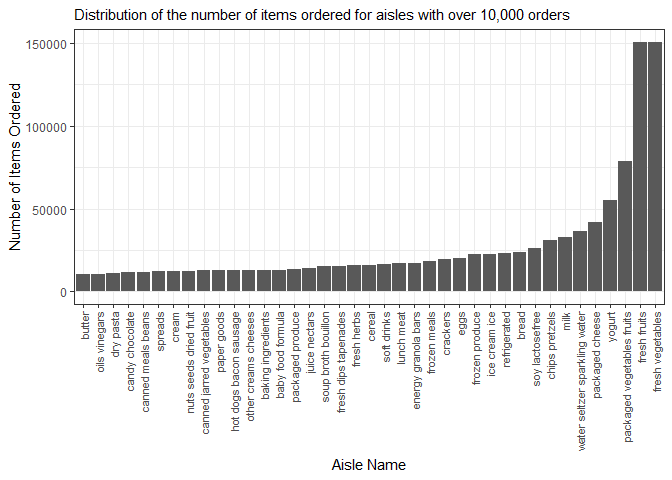

p8105\_hw3\_as6183
================

# Problem 1:

``` r
library(p8105.datasets)
library(tidyverse)
```

    ## -- Attaching packages -------------------------------------- tidyverse 1.3.0 --

    ## v ggplot2 3.3.2     v purrr   0.3.4
    ## v tibble  3.0.3     v dplyr   1.0.1
    ## v tidyr   1.1.2     v stringr 1.4.0
    ## v readr   1.3.1     v forcats 0.5.0

    ## -- Conflicts ----------------------------------------- tidyverse_conflicts() --
    ## x dplyr::filter() masks stats::filter()
    ## x dplyr::lag()    masks stats::lag()

``` r
library(plyr)
```

    ## ------------------------------------------------------------------------------

    ## You have loaded plyr after dplyr - this is likely to cause problems.
    ## If you need functions from both plyr and dplyr, please load plyr first, then dplyr:
    ## library(plyr); library(dplyr)

    ## ------------------------------------------------------------------------------

    ## 
    ## Attaching package: 'plyr'

    ## The following objects are masked from 'package:dplyr':
    ## 
    ##     arrange, count, desc, failwith, id, mutate, rename, summarise,
    ##     summarize

    ## The following object is masked from 'package:purrr':
    ## 
    ##     compact

``` r
library(dplyr)
data("instacart")
```

The Instacart data set gives information on over 3 million online
grocery orders from more than 200,000 Instacart users in 2017. The size
of this dataset is 1384617 rows and 15 columns. Some key variables would
be the reordered variable to assess what customers are re-buying
frequently, the product name to analyze what products are customers
buying most and least frequently, the user id to keep track of which
customer is buying what, and the department to analyze which category of
items are getting purchased most/least frequently.

``` r
number_aisles = count(instacart,vars=c('aisle','aisle_id'))%>%
  nrow()

most_ordered = instacart%>%
  count(vars=c('aisle','aisle_id'))%>%
  select('freq')%>%
  max()
```

There are 134 aisles and

``` r
library(ggplot2)
aisles_10000 = instacart%>%
  count(vars=c('aisle','aisle_id'))%>%
  filter(freq>10000)

instacart_10000 = filter(instacart,aisle%in%pull(aisles_10000,aisle))

ggplot(instacart_10000,aes(x=aisle))+geom_bar()
```

<!-- -->

``` r
#library(data.table)
data = instacart%>%
  filter(aisle=="baking ingredients"|aisle=="dog food care"|aisle=="packaged vegetables fruits")

most_popular = data%>%
  count(vars=c('aisle','product_name'))

most_popular = most_popular%>%
  group_by(aisle)%>%
  dplyr::arrange(desc(freq),by_group=T)%>%
  top_n(n=3,wt=freq)

#data.table(aisle=pull(most_popular,aisle),product_name=pull(most_popular,product_name),freq=pull(most_popular,freq))
```

``` r
library(dplyr)
pink_lady_coffee_ice_cream = instacart%>%
  filter(product_name=="Pink Lady Apples"|product_name=="Coffee Ice Cream")%>%
  group_by(order_dow,product_name)
  
table = dplyr::summarise(pink_lady_coffee_ice_cream,mean=mean(order_hour_of_day))%>%
  ungroup()%>%
  pivot_wider(names_from=order_dow,values_from=mean)
```

    ## `summarise()` regrouping output by 'order_dow' (override with `.groups` argument)

``` r
colnames(table) = c("Product Name", "Monday", "Tuesday","Wednesday","Thursday","Friday","Saturday","Sunday")
table
```

    ## # A tibble: 2 x 8
    ##   `Product Name`   Monday Tuesday Wednesday Thursday Friday Saturday Sunday
    ##   <chr>             <dbl>   <dbl>     <dbl>    <dbl>  <dbl>    <dbl>  <dbl>
    ## 1 Coffee Ice Cream   13.8    14.3      15.4     15.3   15.2     12.3   13.8
    ## 2 Pink Lady Apples   13.4    11.4      11.7     14.2   11.6     12.8   11.9
